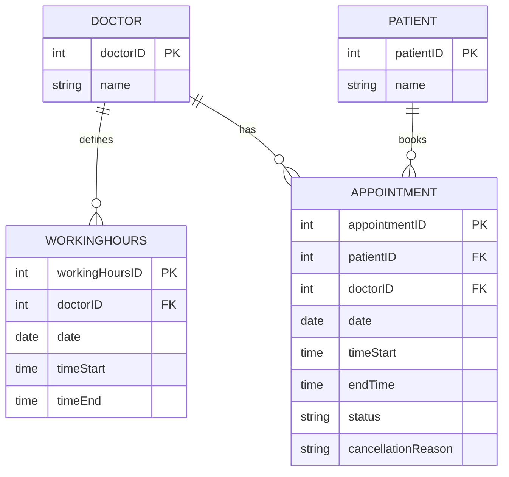

# Care Clinic Booking System

## Goals

Ensure smooth booking of appointments at our clinic.

## Scope

- The clinic has 5 doctors.
- A patient can book an appointment online.
- A patient can see a doctor's free slots on a given day.
- A patient can pick a slot and book it.
- A slot is not available after being booked.
- A patient can cancel or reschedule an appointment.
- A patient cannot reschedule a cancelled appointment.
- A slot becomes available again after a cancellation or reschedule.
- A patient cannot book an appointment starting less than one hour from now.
- A doctor's working hours cannot be edited through the API once set.
- A patient can view their own upcoming, booked appointments, sorted by date.

## Constraints

- Doctors cannot be added through the system; this is handled manually.
- The one-hour booking buffer cannot be overridden by a doctor, even if the doctor is open to appointments within that window.
- Lunch-hour scheduling is not modeled.
- There is no authentication in this version.
- The patient and clinic are assumed to be in the same timezone.

## Key Stakeholders

- Doctor
- Patient

## High-Level Flow

Patient actions: book appointment, cancel appointment, reschedule appointment, view appointments.
Doctor actions: view schedule.

**Book appointment:**
select doctor → select date → view available slots → select a slot → verify booking → success

**Cancel appointment:**
view appointments → select an appointment → verify cancellation → success

**Reschedule appointment:**
view appointments → select an appointment → verify reschedule → select new date → view available slots → select a slot → verify new booking → success

Cancel and reschedule follow the same shape as the last three steps of the booking flow above (select → confirm → success), just starting from an existing appointment instead of a fresh doctor/date selection.

**View appointments:**
select view appointments → view list of own upcoming, booked appointments, sorted by date

This is also the entry point for cancel and reschedule — a patient sees their appointments here first, then picks one to act on.

## Database Schema

**Patient**
- `patientID` (PK)
- `name`

**Doctor**
- `doctorID` (PK)
- `name`

**WorkingHours**
- `workingHoursID` (PK)
- `doctorID` (FK)
- `date`
- `timeStart`
- `timeEnd`

**Appointment**
- `appointmentID` (PK)
- `patientID` (FK)
- `doctorID` (FK)
- `date`
- `timeStart`
- `endTime`
- `status` (booked, cancelled, rescheduled)
- `cancellationReason`

### Entity–Relationship

- A patient can have 0 or many appointments.
- An appointment belongs to exactly 1 patient and exactly 1 doctor.
- A doctor can have 0 or many appointments.
- A doctor can have many working-hours records, one per date.
- Each working-hours record belongs to exactly 1 doctor.

## Components
 
- **API layer** — exposes the REST endpoints (booking, availability, cancel, reschedule, view appointments) and handles request/response shape and status codes.
- **Availability engine** — computes a doctor's free 30-minute slots for a given date by taking their `WorkingHours` for that date and subtracting any slots already covered by a `booked` `Appointment`.
- **Validation layer** — enforces the booking rules before a write ever hits the database: slot falls within working hours, not in the past, not within the one-hour buffer, and not already taken.
- **Persistence layer** — the database and its constraints, including the partial unique index on `(doctorID, date, timeStart)` that prevents double-booking at the data layer as a last line of defense, independent of the validation layer above.

## Design Decisions

1. **Doctors cannot manage their own working hours through the API.**
   Allowing edits would require handling the case where a doctor changes their hours after a patient has already booked outside the new timeframe — that needs more time to implement properly, so it's deferred to v2.

2. **Chose a unique DB constraint on `(doctorID, date, timeStart)` over transaction-based row locking for booking validation.**
   A separate table of precomputed available slots would introduce write contention and risk deadlocks under high traffic as the clinic grows. This means cancellation and rescheduling must be handled carefully: the constraint is implemented as a partial unique index (unique only where `status = 'booked'`), so a slot becomes bookable again as soon as its appointment is cancelled or rescheduled.

3. **Cancelled and rescheduled appointments free up their slot.** Their rows remain in the `Appointment` table for history, but the slot itself is shown as available again.

4. **A reschedule updates the existing appointment row** rather than creating a new one — meaning reschedule history isn't preserved in v1.

5. **Slots within the next hour are filtered out at generation time**, rather than being shown and then rejected at booking time. This keeps the experience smoother — patients only ever see slots they can actually book.

1. **Cancelling and rescheduing of past appointments.**
   Without this check, a patient could reschedule or cancel an appointment that already happened — which doesn't reflect reality and could be used to manipulate historical booking data.I chose not to introduce a status "completed" that would require deciding who or what transitions an appointment out of booked once its time passes. Rather I choose a simple fix, checking the appointment's own date/time against "now" directly inside cancel and reschedule validation — covers the actual risk

## V2 Improvements

1. Allow doctors to make adjustments to their working hours.
2. If a doctor changes working hours after a patient has already booked: if the doctor can still accommodate the existing appointment, keep it and shift the remaining slots; otherwise, notify the patient and prompt them to reschedule.
3. Add an urgency column to appointments.
4. Introduce a completed status transitioned automatically once an appointment's time passes, replacing the direct date/time checks in cancel and reschedule with a single status check.